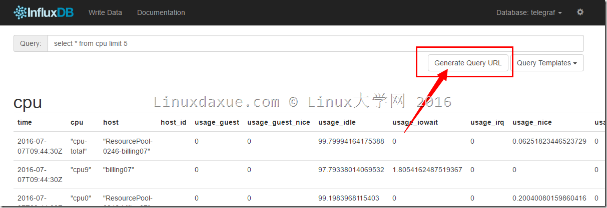

# HTTP API查询操作

## 说明
官方文档上介绍说，使用HTTP API进行查询是比较初级的一种方式。推荐使用第三方语言库和客户端管理程序进行查询操作。

## InfluxDB进行HTTP API查询方法
使用HTTP API在InfluxDB进行查询主要是发送 GET 请求到 InfluxDB的 /query 端，调用示例如下所示：

	curl -GET 'http://localhost:8086/query?pretty=true' --data-urlencode "db=mydb" 
	--data-urlencode "q=SELECT value FROM cpu_load_short WHERE region='us-west'"
参数db指定了需查询的数据库，q代表了需执行的查询语句。

在页面中也提供了生成HTTP 请求URL的方法，如下所示：

在界面上输入语句后，点击生成url就会生成http请求URL。

在浏览器执行后，会返回json格式的串。

如果查询出错的话，则会返回关键词“error”+错误信息。

## InfluxDB进行HTTP API查询多条数据
我们可能需要用InfluxDB进行多条查询，HTTP API提供的多条查询的格式如下所示：

	curl -G 'http://localhost:8086/query?pretty=true' --data-urlencode "db=mydb" --data-urlencode "q=SELECT value FROM cpu_load_short WHERE region='us-west';
	SELECT count(value) FROM cpu_load_short WHERE region='us-west'"
格式与单条查询相同，只是在多条语句之间要用分号“；”分隔。

返回值也是包含结果的json串。

## InfluxDB HTTP 查询的格式化输出
### 规定时间格式

在使用HTTP查询时可以使用 epoch 参数指定输出的时间格式。可选值有 epoch=[h,m,s,ms,u,ns]。

例如：

	curl -G 'http://localhost:8086/query' --data-urlencode "db=mydb" 
	--data-urlencode "epoch=s" --data-urlencode "q=SELECT value FROM cpu_load_short WHERE region='us-west'"
这样会获取到以秒为单位的时间数据。

### 指定每次查询数据大小

可以使用 chunk_size 参数来指定每次结果的大小。比如，我要结果每次返回200个点的数据，则如下所示：

	curl -G 'http://localhost:8086/query' --data-urlencode "db=mydb" --data-urlencode "chunk_size=200" --data-urlencode "q=SELECT value FROM cpu_load_short WHERE region='us-west'"
	
这样查询结果就会返回200个点的数据。
